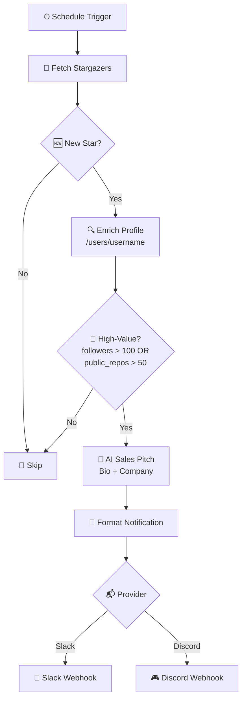

<div align="center">


<br/>

[](https://n8n.io)
[](https://docs.github.com/en/rest)
[](#)
[](https://api.slack.com/messaging/webhooks)
[](https://discord.com/developers/docs/resources/webhook)
[](https://www.docker.com/)
[](#license)

</div>

---

## 🎯 What is LeadSniper?

**LeadSniper** is a self-hosted automation pipeline that quietly watches a GitHub repository's stargazers and turns the *interesting* ones into ready-to-send sales leads — with zero manual digging.

Every time someone new stars your repo, LeadSniper:

1. **Notices** the star the moment it's polled.
2. **Pulls their full GitHub profile** — bio, company, followers, public repos, and more.
3. **Scores them** against a strict, no-nonsense qualification rule.
4. **Writes a one-sentence, human-sounding pitch** for why they're worth reaching out to — grounded only in real profile data, never invented.
5. **Drops it straight into Slack or Discord**, ready for your team to act on.

No spreadsheets. No manual profile-checking. No stale lead lists.

---

## ✨ Features

- 🔭 **Real-time stargazer monitoring** via scheduled polling
- 🧠 **Automatic profile enrichment** using `GET /users/{username}`
- 🎯 **Deterministic High-Value Lead scoring** — `followers > 100 OR public_repos > 50`
- ✍️ **AI-generated, fact-grounded sales pitches** (no hallucinated job titles, skills, or funding claims)
- 🔁 **Built-in deduplication** so nobody gets alerted twice for the same star
- 🛡️ **GitHub rate-limit aware** — reads response headers, backs off safely, and never spirals into retry loops
- 🔀 **Slack or Discord** output, switchable with one field
- 🎬 **One-click demo mode** for a deterministic, repeatable test run
- 🧪 **Automated tests** for the scoring logic, dedupe keys, and backoff behavior

---

## 🧭 How It Works



A parallel **Manual Demo Trigger** runs the exact same enrichment → scoring → AI → notification path against a single test user, so the whole pipeline can be demonstrated on demand without waiting for a real star.

---

## 💎 The High-Value Lead Rule

A stargazer qualifies the moment **either** condition is strictly true:

```
followers > 100   OR   public_repos > 50
```

| Followers | Public Repos | Result         |
|----------:|-------------:|----------------|
| 101       | 0             | ✅ High-Value  |
| 0         | 51            | ✅ High-Value  |
| 101       | 51            | ✅ High-Value  |
| 100       | 50            | ❌ Skipped     |
| 25        | 20            | ❌ Skipped     |

The comparisons are intentionally strict (`>`, never `>=`) — the boundary is exact and non-negotiable.

---

## 🤖 The AI Sales Pitch

The model only ever sees two fields — **Bio** and **Company** — and is instructed to:

- Use *only* the information it's given
- Never invent a job title, skillset, funding status, or purchasing authority
- Return **exactly one** concise, professional sentence

That constraint keeps every pitch honest: if someone's bio and company are thin, the pitch is thin too — no fabricated context, ever.

**Example notification:**

```
🚀 High-Value GitHub Lead

Name: Example User
Company: Example Company

Bio:
Interested in open-source AI and developer tooling.

Followers: 120
Public Repositories: 52

AI Sales Pitch:
Their interest in open-source AI and developer tooling makes them a
potentially relevant technical contact for outreach.
```

---

## 🛡️ Reliability Engineering

LeadSniper is built to survive real-world GitHub API behavior, not just the happy path:

- **Authenticated requests** for a much higher rate-limit ceiling
- **Bounded work per cycle** — a capped number of stars and profile lookups per poll, never unbounded
- **Serial profile enrichment** rather than concurrent bursts, to avoid secondary rate limiting
- **Header-aware backoff** — reads `x-ratelimit-remaining`, `x-ratelimit-reset`, and `retry-after`, and either retries with bounded exponential backoff or cleanly stops the cycle if the reset is too far out
- **Graceful error handling** for `403`, `404`, `429`, and transient `5xx` responses — one bad profile never brings down the run
- **Deterministic deduplication** using a persistent `owner/repo:username` key, so restarts and re-polls never double-alert

Full reasoning lives in [`LOGIC_LOG.md`](./LOGIC_LOG.md).

---

## 🧱 Tech Stack

| Layer            | Choice                        |
|-------------------|-------------------------------|
| Orchestration      | [n8n](https://n8n.io) (self-hosted, Docker) |
| Data source        | GitHub REST API (`stargazers`, `/users/{username}`) |
| Intelligence       | LLM node (Gemini / OpenAI compatible) |
| Delivery           | Slack Incoming Webhook · Discord Webhook |
| State              | n8n workflow static data |
| Runtime            | Docker Compose |

---

## 🚀 Quick Start

```bash
# 1. Clone and enter the project
cd LeadSniper/n8n

# 2. Configure environment
cp .env.example .env
# fill in GITHUB_TOKEN, repo owner/name, webhook URLs, etc.

# 3. Launch
docker compose --env-file ./.env up -d

# 4. Open the canvas
open http://localhost:5678
```

Import `lead-sniper.workflow.json`, wire up your GitHub / LLM / Slack / Discord credentials, then either:

- Fire the **Manual Demo Trigger** for an instant, repeatable test run, or
- **Activate** the workflow to let the Schedule Trigger poll every 15 minutes in production.

```bash
# Run the logic test suite
npm test
```

Tests cover the scoring thresholds, dedupe key construction, and backoff timing.

---

## 📂 Project Structure

```
LeadSniper/
└── n8n/
    ├── .env.example
    ├── .gitignore
    ├── docker-compose.yml
    ├── lead-sniper.workflow.json
    ├── COMMANDS.md
    ├── LOGIC_LOG.md
    └── README.md
```

`.env`, tokens, and webhook URLs are **never** committed — see `.gitignore`.

---

## 🗺️ Roadmap

- [ ] Webhook-based (event-driven) stargazer detection instead of polling
- [ ] Configurable, multi-tier lead scoring (not just a single boolean rule)
- [ ] CRM export (HubSpot / Notion / Airtable)
- [ ] Multi-repo monitoring from one workflow
- [ ] Lead-quality feedback loop back into the AI prompt

---

## 📜 License

Released under the **MIT License** — use it, fork it, point it at your own repo.

<div align="center">


</div>
